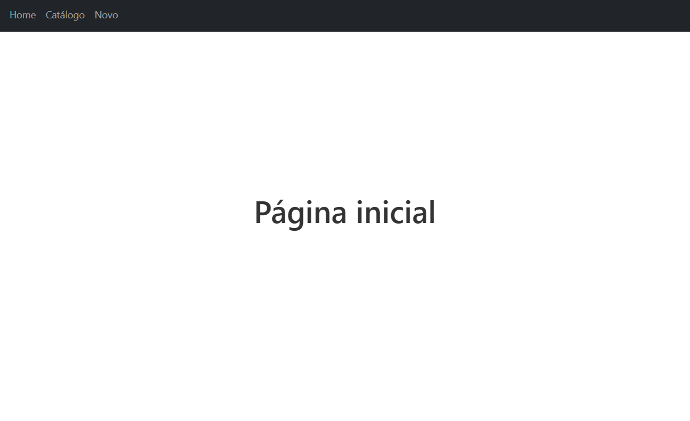
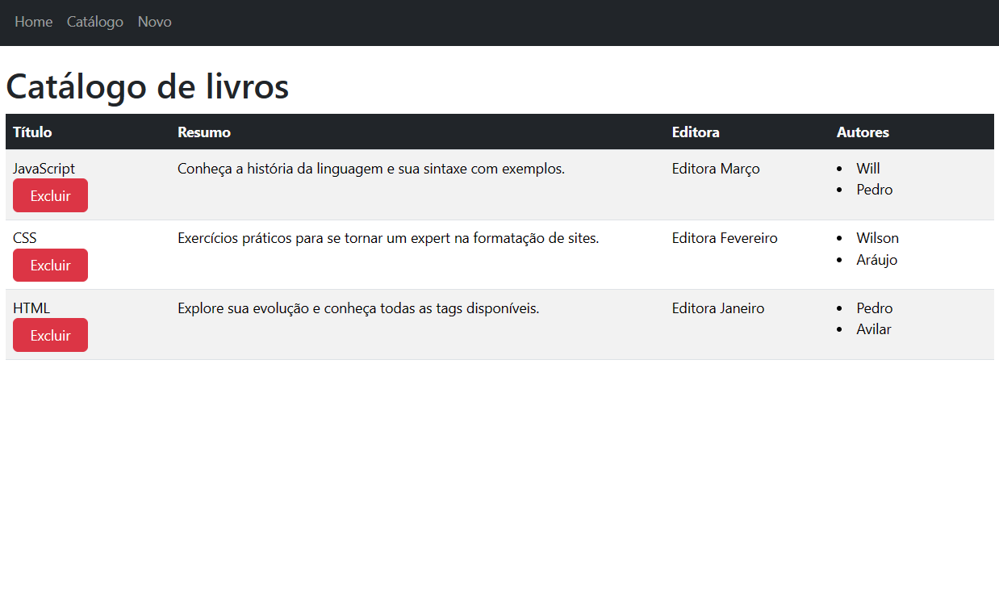
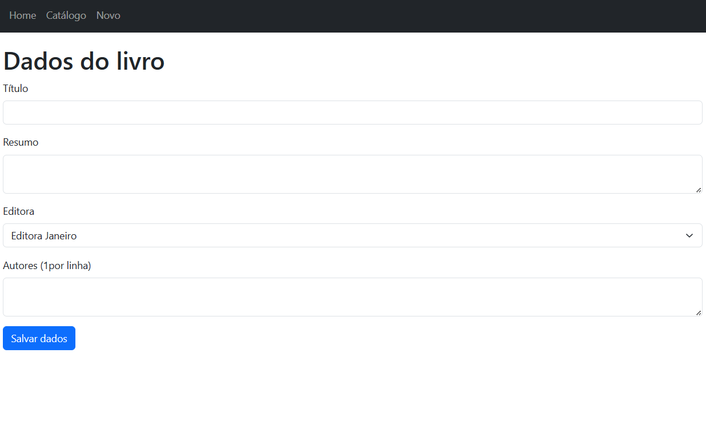

# Faculdade Estácio
## Curso Desenvolvimento Full Stack
## Mundo 2 - Nível 5
## Pedro Wilson Araújo Avilar
## Matrícula 2023 0916 8251

### Página de listagem e cadastro de livros
Servidor baseado em Express e Mongoose, acessando o banco de dados MongoDB, e front-ends baseados em ReactJS, NextJS e Angular.

As imagens são do front-end com NextJS. Em termos de aparência não houve mudanças significativas para os demais front-ends.